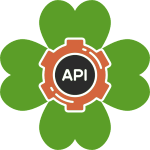

# Trebol API Starter Kit




A tool to start coding your API right away. This project allows to the automatic generation of domains/modules (groups of entities) and entities for a better organization. It also integrates the automatic Swagger spec file generation.
 

## Getting Started

To get started it is only necessary to clone this repository, install all the dependencies and start your server.

```bash
  git clone https://github.com/xvicmanx/trebol-api-starter-kit
  npm install
  npm start
```

After starting up your server go to
`http://localhost:3000/api-docs` your API swagger spec documentation.

At the beginning, as an example, there is the `tasks-management` domain with only one entity `task`. However, you can get rid of the entire folder and start adding your own domains and entities.

## How to add domains
Simply run the following the command:
```bash
   npm run generate:domain -- --domain "[NAME OF DOMAIN]"
```
This command will create the necessary files to setup and plug the domain to your project.


## How to add entities
It is as simple as it is adding domain. Simply run the following:
```bash
   npm run generate:entity -- --domain "[NAME OF DOMAIN]" --entity "[NAME OF ENTITY]"
```
This command will create the necessary files to setup and plug the entity to the target domain.
Once the entity is added it will generate a series of CRUD endpoints that can be observed in your swagger specification.


## Example
Lets say we want to create a project.
First we start up with the creation of one the domains. Lets say we have the domain `store` that have for example one entity `book`.

```bash
   npm run generate:domain -- --domain "store"
   npm run generate:entity -- --domain "store" --entity "book"
```

Running these commands will generate the files for the domain and entity desired.
It will look like:

```
domains
├── store
|   └── book
│       └── controller.js    # entity's controller
│       └── model.js    # entity's model
│       └── routes.js    # defined routes for entity
│       └── service.js    # entity's service
    └── setUpRoutes.js   # setup for domain routes
│
```
<!-- ## Running the tests

To test the code [Jest](https://facebook.github.io/jest/) is being used.

In order to test your code run the following command: 
```bash
npm test
``` -->


<!-- ## Things this kit includes

* [EditorConfig](http://editorconfig.org/) to maintain consinstency in code style among different editors. See the `.editorconfig` file to customize the configuration.

* [ExpressJS](https://expressjs.com/) to serve our API. See the `scripts/start-server.js` for more details..


* [Localtunnel](https://github.com/localtunnel/localtunnel) to easily share your in development to others.
See the `scripts/share-development.js` for more details. -->


## Contributing

Feel free to make any suggestion to improve this project.


## Authors

See the list of [contributors](https://github.com/xvicmanx/trebol-api-starter-kit/contributors) who participated in this project.

## Roadmap

To know more about the future and current status of the project - see the [ROADMAP.md](ROADMAP.md) file for details.

## License

This project is licensed under the MIT License - see the [LICENSE.md](LICENSE.md) file for details

## Acknowledgements
 Icons made by [Freepik](http://www.freepik.com) from [www.flaticon.com](https://www.flaticon.com/) is licensed by [CC 3.0 BY](http://creativecommons.org/licenses/by/3.0/)
